# Technical Architecture

## Overview

Nudge is a direct-distribution macOS app with a menu bar UI, onboarding, local connectors, a local database, a local-first AI pipeline, and action executors for Calendar, Reminders, notifications, and source-app opening.

The architecture prioritizes local data control, observable permission health, and graceful degradation when macOS or source access changes.

## Process Model

Primary components:

- Main app: owns menu bar UI, onboarding, settings, suggestion review, and action confirmation.
- Background helper: user-approved Login Item or LaunchAgent that performs scheduled ingestion and analysis.
- Local database: stores source metadata, normalized messages, summaries, suggestions, actions, permission health, and audit events.
- Connector workers: read from Apple Messages local storage.
- AI engine: performs local extraction/classification and optional consent-gated cloud reasoning.
- Action executors: write confirmed actions to Calendar/Reminders and issue notifications.

The main app and helper communicate through XPC or an equivalent local IPC mechanism. The helper must not require root privileges.

## Data Flow

```mermaid
flowchart LR
    A["Apple Messages local data"] --> C["Connector worker"]
    C --> D["Normalization and dedupe"]
    D --> E["Local SQLite store"]
    E --> F["Local AI extraction"]
    F --> G["Suggestion engine"]
    G --> H["Menu bar inbox"]
    H --> I["User confirmation"]
    I --> J["Calendar / Reminders / Notifications"]
    F -. optional consented snippets .-> K["Cloud AI provider"]
    K -. structured result .-> G
```

## Recommended Technology Choices

- Language: Swift.
- UI: SwiftUI for windows/settings, AppKit where needed for menu bar integration.
- Background: SMAppService for Login Item or LaunchAgent registration on modern macOS.
- Local storage: SQLite with an application-managed schema.
- Sensitive values: Keychain for encryption keys and future secrets; alpha Gemini config is saved outside the repo.
- Calendar/Reminders: EventKit.
- Notifications: UserNotifications.
- Distribution: Developer ID signing, Hardened Runtime, notarization, and signed updates.

## Local Data Model

Core entities:

- Source: app or import origin, connector type, health, last sync time.
- Thread: source thread identifier, participant labels, last message time, active state.
- Message: source message identifier, thread identifier, sender label, timestamp, body, import revision.
- MessageSummary: local summary, source range, generated time, model metadata.
- Suggestion: type, state, title, action payload, confidence, evidence reference, timestamps.
- ActionRecord: target app, fingerprint, confirmed time, external identifier if available, failure reason.
- PermissionHealth: capability, state, last checked time, user-visible impact.
- AuditEvent: privacy-preserving event log for permission changes, connector runs, suggestion creation, user decisions, and deletion.

Raw message bodies should be stored only if required for local search, dedupe, and evidence. If storage is disabled by user policy, the system may store summaries and message fingerprints instead, accepting reduced functionality.

## Apple Messages Connector

The connector should:

- Run read-only.
- Require explicit onboarding and Full Disk Access.
- Discover and validate the local Messages store without assuming permanent schema stability.
- Import the recent 30-day window for context, while active alerts focus on the last 7 days.
- Resolve local Contacts names when permission is available, falling back to phone numbers or email handles.
- Maintain incremental sync cursors in later slices.
- Normalize messages into the local schema.
- Dedupe by stable source identifiers where possible and content fingerprints otherwise.
- Avoid reading attachments unless explicitly required by a future feature.
- Stop and mark health as degraded if schema validation fails.

The connector must not:

- Write to Messages data.
- Send replies.
- Delete or modify conversations.
- Hide access failures from the user.

## AI Pipeline

The AI pipeline has four stages:

1. Preprocessing: normalize message text, timestamps, participants, and thread windows.
2. Local extraction: detect dates, questions, commitments, and reply gaps using local parsers/classifiers.
3. Suggestion generation: create typed suggestions with evidence references and confidence.
4. Optional cloud reasoning: send only consented snippets or summaries for higher-quality interpretation.

Cloud AI must return structured output. The app must validate output before creating suggestions.

## Suggestion Engine

The suggestion engine should:

- Require evidence for every suggestion.
- Suppress duplicates using source message ranges and action fingerprints.
- Apply user dismissal history to reduce repeated false positives.
- Prioritize suggestions by urgency, confidence, source freshness, and user history.
- Convert permission failures into needs-permission suggestions only when user action can fix them.

## Action Executors

Calendar and reminder executors:

- Run only after user confirmation.
- Validate permission immediately before writing.
- Create a durable ActionRecord after success.
- Use idempotency fingerprints to prevent duplicates.
- Return clear failure reasons to the UI.

Reply-related actions:

- May draft or copy text.
- May open the source app/thread where feasible.
- Must not send messages or email automatically in v1.

## Permission Health

The app must periodically check:

- Full Disk Access effect on Messages connector.
- Notifications authorization.
- Calendar authorization.
- Reminders authorization.
- Login Item or LaunchAgent status.

Permission health should be stored locally and surfaced in onboarding, settings, and the menu bar warning state.

## Distribution and Updates

V1 distribution should use:

- Developer ID certificate.
- Hardened Runtime.
- Notarization.
- Signed application bundle.
- Signed automatic update framework or equivalent direct-update mechanism.

The app should include a visible version, update channel, privacy policy link, and support path.

## Failure Modes

- Messages store unavailable: mark connector degraded and retain existing suggestions.
- Permission revoked: pause affected connector or executor and surface repair.
- Database migration fails: keep a backup and prevent destructive migration.
- Cloud AI unavailable: continue local suggestions.
- Background helper stopped: show repair notification and menu bar warning.
- Duplicate import: dedupe and show import summary.
